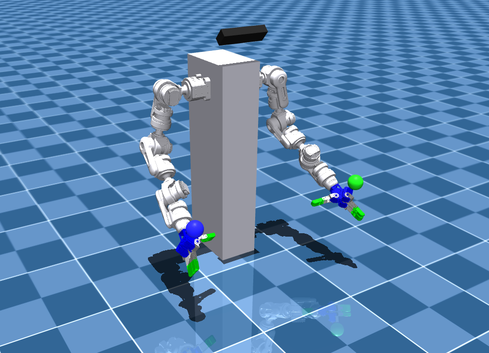

### Citation
**This project uses code from the mink project by Kevin Zakka (https://github.com/kevinzakka/mink), licensed under Apache-2.0.**
``` bibtex
@software{Zakka_Mink_Python_inverse_2026,
  author  = {Zakka, Kevin},
  title   = {{Mink: Python inverse kinematics based on MuJoCo}},
  year    = {2026},
  month   = feb,
  version = {1.1.0},
  url     = {https://github.com/kevinzakka/mink},
  license = {Apache-2.0}
}
```

### load_any_xml.py
check to see if MJCF files are properly loaded

### single_arm_mink_ik.py
single arm IK

### bimanual_mink_ik.py
bimanual IK

### make conda env
```bash
conda create -n <env_name> python=3.10
conda activate <env_name>
```
### dependencies
```bash
pip install -r requirements.txt
```
### run codes
bimanual example
```bash
python3 bimanual_mink_ik.py
```


**double click mocap target(green/blue sphere) and press \
ctrl + left click for orientation control and \
ctrl + right click for position control**